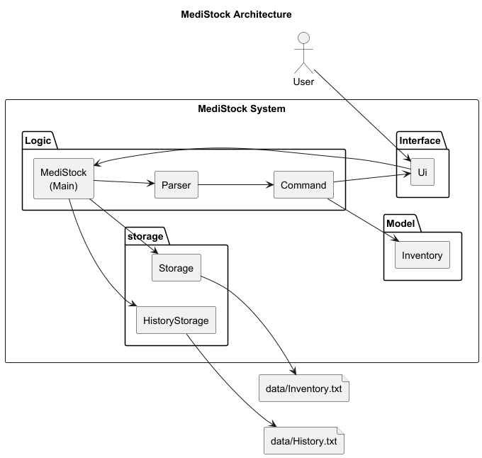
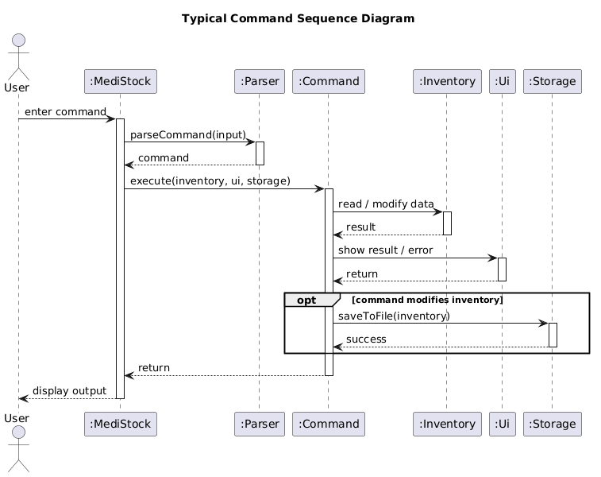
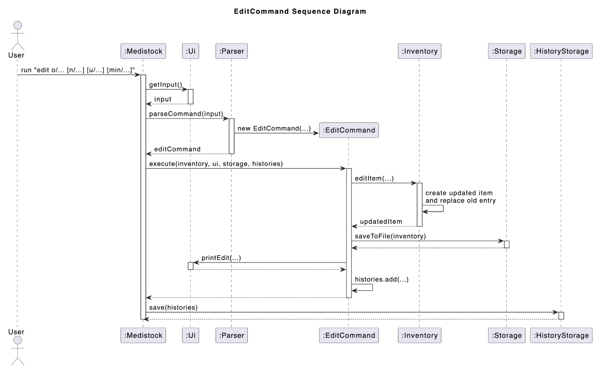
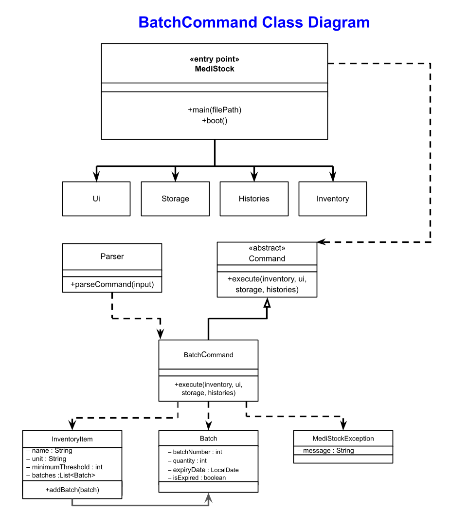
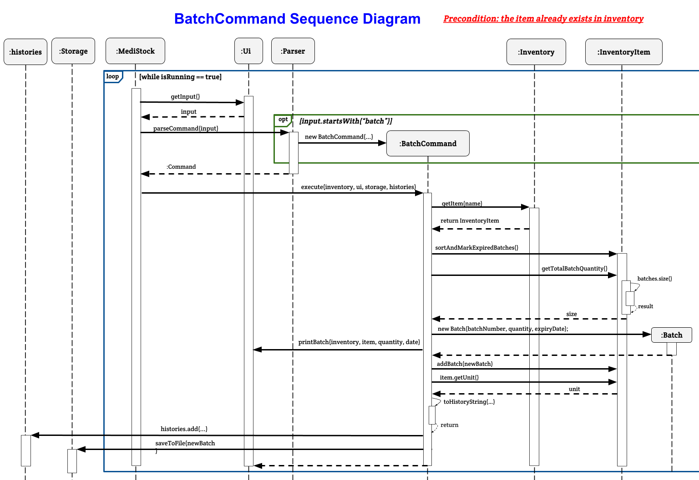
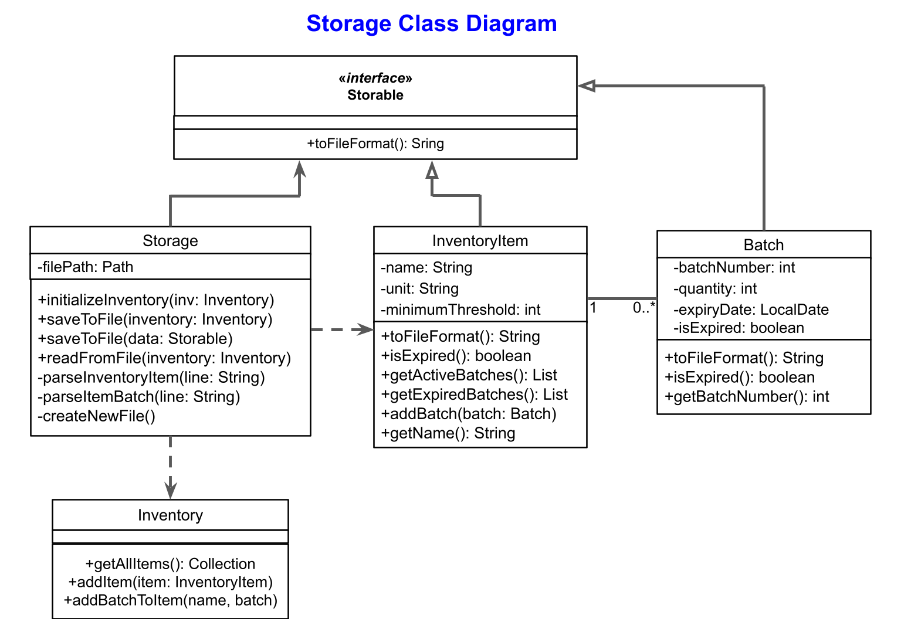
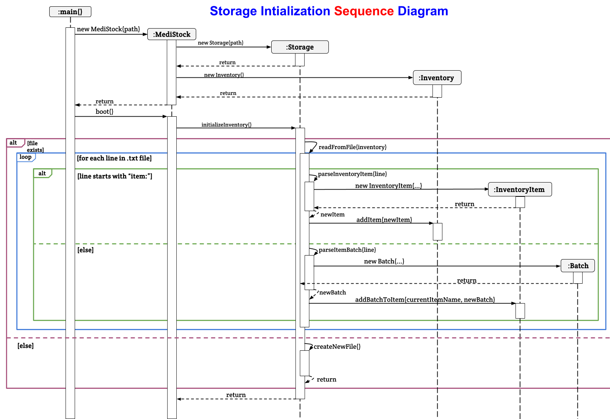
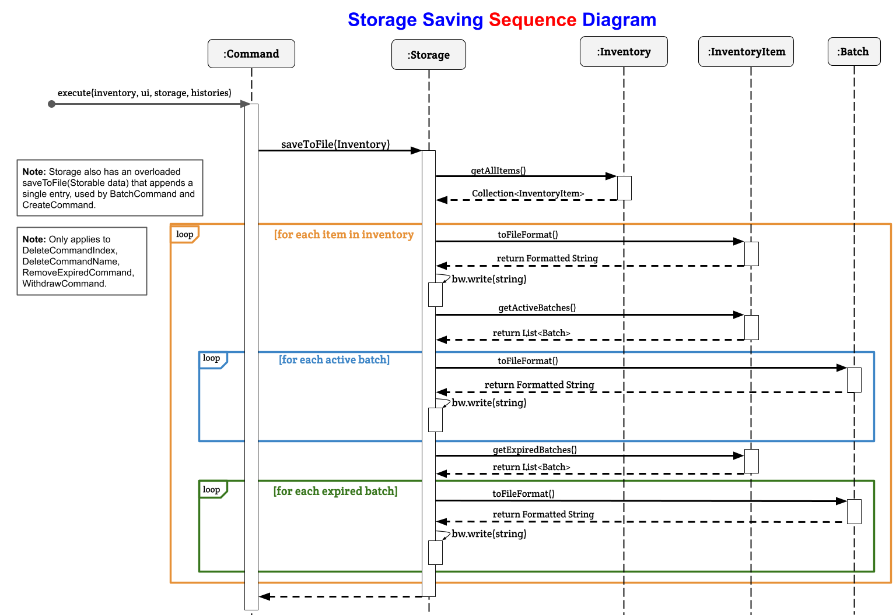

# Developer Guide

## Table of Contents
- [Acknowledgements](#acknowledgements)
- [Design](#design)
- [Implementation](#implementation)
    - [Feature: Create Item](#feature-create-item)
    - [Feature: Edit Item](#feature-edit-item)
    - [Feature: Add Batch](#feature-add-batch)
    - [Feature: Withdraw Stock](#feature-withdraw-stock)
    - [Feature: Delete Item by Name](#feature-delete-item-by-name)
    - [Feature: Delete Item by Index](#feature-delete-item-by-index)
    - [Feature: List Inventory](#feature-list-inventory)
    - [Feature: Find Item](#feature-find-item)
    - [Feature: Remove Expired Batches](#feature-remove-expired-batches)
    - [Feature: Automatic Expiry Detection](#feature-automatic-expiry-detection)
    - [Feature: Low Stock Warning](#feature-low-stock-warning)
    - [Feature: Help Command](#feature-help-command)
    - [Feature: Exit Command](#feature-exit-command)
    - [Feature: Data Storage](#feature-data-storage)
- [Product scope](#product-scope)
    - [Target user profile](#target-user-profile)
    - [Value proposition](#value-proposition)
- [User Stories](#user-stories)

***
## Acknowledgements

This developer guide was inspired by 
(https://se-education.org/addressbook-level4/DeveloperGuide.html#design)
<br>
Tools that helped with the creation of the MediStocks logo: <br>
(https://www.asciiart.eu/text-to-ascii-art) <br>
(https://www.asciiart.eu/image-to-ascii)

## Design

The Architecture Diagram below shows the high-level design of Medistock.


How the architecture components interact:



The sequence of interactions for a typical command, such as `withdraw n/paracetamol q/5`, is:

1. `MediStock` reads the user input from the command line.
2. `MediStock` passes the raw input to the `Parser` for interpretation.
3. The `Parser` validates the format and returns the appropriate `Command` object.
4. `MediStock` executes the `Command`.
5. The `Command` interacts with `Inventory` to read or modify the in-memory data.
6. The `Command` uses `Ui` to display the success message, error message, or requested output.
7. If the command changes the inventory, `Storage` saves the updated data to file.

## Implementation

### Feature: Create Item

{UML diagrams to be implemented}

**Purpose:** Create a new item in the inventory with its name, unit, and minimum threshold.

**Command word:** `create`

**Format:**
```
create n/<name> u/<unit> min/<threshold>
```

Creates a new `InventoryItem` using the specified name, unit, and minimum threshold, then adds it to the inventory for future batch tracking.
The created item does not contain any batches yet; stock is added later through the `batch` command.

**Behaviour:**
1. Parses the user input to extract the item name, unit, and minimum threshold.
2. Validates that `n/`, `u/`, and `min/` are present and that they appear in the correct order.
3. Validates that name, unit, and minimum threshold are not empty.
4. Parses the minimum threshold as a positive integer.
5. Creates a `CreateCommand` with the validated values.
6. Creates a new `InventoryItem` with the specified metadata and no batches, then calls `inventory.addItem(item)` to add it to the inventory.
7. `inventory.addItem(item)` checks that another item with the same normalized name does not already exist.
8. Calls `storage.saveToFile(item)` to append the new item to storage.
9. Calls `ui.printCreate(name, unit, minimumThreshold)` to display the created item details.
10. Records the creation in the command history.

**Failure cases & messages:**
- If `n/`, `u/`, or `min/` is missing: "Invalid create format. Format: create n/NAME u/UNIT min/THRESHOLD"
- If the argument order is invalid: "Use create format: Format: create n/NAME u/UNIT min/THRESHOLD"
- If name, unit, or minimum threshold is empty: "Name, unit, and minimum threshold must not be empty."
- If the minimum threshold is not a valid number: "Minimum threshold must be a valid number."
- If the minimum threshold is zero or negative: "Minimum threshold must be greater than 0."
- If the item already exists in inventory: "Product already exists: \<name\>"
- If saving to file fails: "Failed to save to file: \<message\>"

**Logging:**
- WARNING when attempting to add a duplicate item.
- INFO on successful item creation.

### Feature: Edit Item



**Purpose:** Edit an existing item in the inventory by updating its name, unit, minimum threshold, or a combination of these fields.

**Command word:** `edit`

**Format:**
```
edit o/<old_name> [n/<new_name>] [u/<new_unit>] [min/<new_threshold>]
```

Finds the specified item using its current name, applies the requested updates, preserves its existing batches, and replaces the original item in the inventory with the updated version.

**Behaviour:**
1. Parses the user input to extract the old item name and the fields to update.
2. Validates that `o/` is present and that at least one of `n/`, `u/`, or `min/` is provided.
3. Calls `inventory.editItem(...)` to retrieve the current `InventoryItem` and determine the updated values.
4. If a new name is provided, checks that it does not conflict with another existing item in the inventory.
5. Creates an updated `InventoryItem` with the new metadata while preserving the existing batches, then replaces the old item entry in the inventory.
6. Calls `storage.saveToFile(inventory)` to persist the updated inventory.
7. Calls `ui.printEdit(oldName, updatedItem)` to display the updated item details.
8. Records the edit in the command history.

**Failure cases & messages:**
- If `o/` is missing: "Invalid edit format. Format: edit o/OLD_NAME [n/NEW_NAME] [u/NEW_UNIT] [min/NEW_THRESHOLD]"
- If no fields are provided to update: "Edit command requires at least one field to update."
- If the argument order is invalid: "Use edit format: Format: edit o/OLD_NAME [n/NEW_NAME] [u/NEW_UNIT] [min/NEW_THRESHOLD]"
- If the old item name is empty: "Old item name must not be empty."
- If the new item name is empty: "New item name must not be empty."
- If the new unit is empty: "New unit must not be empty."
- If the new minimum threshold is empty: "New minimum threshold must not be empty."
- If the new minimum threshold is not a valid number: "New minimum threshold must be a valid number."
- If the new minimum threshold is zero or negative: "New minimum threshold must be greater than 0."
- If the item does not exist in inventory: "Product not found: \<old_name\>"
- If the new name already exists in inventory: "Product already exists: \<new_name\>"

**Logging:**
- WARNING when attempting to get a non-existent item.
- FINE on successful item retrieval.

### Feature: Add Batch


**Purpose:** Add a new batch of stock to an existing medication or inventory item,
tracking its specific quantity and expiry date.

**Command Word:** `batch`
**Format:**
```
batch n/<name> q/<quantity> d/<expiryDate>
```
Finds the item by name in the inventory, organizes existing batches to flag expired ones,
generates a new batch with the specified quantity and expiry date, and appends it to the item's record.
Finally, it updates the storage file and command history.

**Behaviour:**
1. Parses the user input using prepareBatch to extract the item name, quantity, and expiry date.
2. Validates that all prefixes `(n/, q/, d/)` are present and in the correct sequential order.
3. Ensures the quantity is a positive integer. and expiry date matches the `YYYY-MM-DD` format
4. Instantiates a new `BatchCommand` with the extracted parameters
5. Calls `BatchCommand.execute()`, which also checks if the item exists in the inventory.
6. Calls `item.sortAndMarkExpiredBatches()` to organize the item's current stock
7. Calculates the new batch number and instantiates the `Batch` object
8. Calls `item.addBatch(newBatch)` to attach it to the inventory item
9. Calls `ui.printBatch()` to display the success message and updated stock details
10. Records the addition in the command history and saves the new batch to storage via `storage.saveToFile()`.

**Failure cases & messages:**
- If any prefix is missing: "Invalid batch format. Format: batch n/NAME q/QUANTITY d/EXPIRY_DATE(YYYY-MM-DD)"
- If prefixes are out of order: "Ensure the arguments are in the correct order:"
- If quantity is not a number or is empty: "Invalid quantity. Please enter a positive whole number for the quantity"
- If expiry data format is incorrect: "Invalid expiry date. Please use a valid format (e.g., YYYY-MM-DD)."
### Feature: Withdraw Stock


**Purpose:** Withdraw a specified quantity of an item from the inventory, depleting from the earliest-expiring batches first.

**Command word:** `withdraw`

**Format:**
```
withdraw n/<name> q/<quantity>
```

Finds the item by name, sorts its batches by expiry date (earliest first), marks any expired batches, then deducts the requested quantity from the remaining non-expired batches. Batches that reach zero quantity are removed. If the withdrawal spans multiple batches, earlier batches are fully depleted before moving to the next.

**Behaviour:**
1. Parses the user input to extract the item name and quantity.
2. Validates that the name and quantity are not empty, that quantity is a valid positive integer, and that `n/` appears before `q/`.
3. Calls `inventory.getItem(name)` to retrieve the corresponding `InventoryItem`.
4. Calls `item.withdraw(quantity)` which:
   - Sorts batches by expiry date (earliest first) and marks expired batches.
   - Checks that total available (non-expired) quantity is sufficient.
   - Deducts from non-expired batches in order, removing fully depleted batches.
5. Calls `ui.printWithdraw(quantity, item)` to display the withdrawn amount and the updated stock.
6. Records the withdrawal in the command history.

**Failure cases & messages:**
- If `n/` or `q/` is missing: "Invalid withdraw format. Format: withdraw n/NAME q/QUANTITY"
- If `n/` does not appear before `q/`: "Use correct format: Format: withdraw n/NAME q/QUANTITY"
- If name or quantity is empty: "Name and quantity must not be empty."
- If quantity is not a valid number: "Quantity must be a valid number."
- If quantity is zero or negative: "Quantity must be greater than 0."
- If item does not exist in inventory: "Product not found: \<name\>"
- If insufficient non-expired stock: "Insufficient stock for \<name\>. Available: \<available\>, Requested: \<quantity\>"

**Logging:**
- WARNING when attempting to get a non-existent item.
- FINE on successful item retrieval.

### Feature: Delete Item by Name


**Purpose:** Delete an entire type of item from the inventory using the item's name.

**Command word:** `delete`

**Format:**
```
delete n/<name>
```

Finds the desired item using the input name given by the user and removes it from the inventory.

If the name of the item does not match any of the items in the inventory, prints "Product not found".

**Behaviour:**
1. Parses the user input to get name of desired item.
2. Calls `items.containsKey(<name>)` to check if an item of the given name exists in the inventory.
3. If it exists, retrieve the corresponding InventoryItem with that name and remove it from the inventory.
4. For the deleted item, calls `ui.printDelete(deletedItem)` to print the deleted item.
5. Inform the user that the item has been deleted successfully.

**Failure cases & messages:**
- If name does not exist in inventory: "Product not found: "
- If input format is invalid: "Invalid delete format. Format: delete 'n/NAME'"

**Logging:**
- INFO on command entry/exit and deleted item.

### Feature: Delete Item by Index


**Purpose:** Delete an entire type of item from the inventory using the item's index in the inventory.

**Command word:** `delete`

**Format:**
```
delete i/<index>
```

Iterate through the inventory to obtain the name of the item at the index specified by the user. Finds the desired item 
using the obtained name and removes it from the inventory.

If the index is out of bounds, prints "Index entered out of bounds! Valid indices: ". If the index is invalid 
(ie not a number), prints "Index must be a valid number."

**Behaviour:**
1. Parses the user input to get the index.
2. Ensures that the input index is a positive integer that is within the size of the inventory.
3. Iterates through the inventory to retrieve the key of item at the index.
4. Retrieve the corresponding InventoryItem with the key and remove it from the inventory.
5. For the deleted item, calls `ui.printDelete(deletedItem)` to print the deleted item.
6. Inform the user that the item has been deleted successfully.

**Failure cases & messages:**
- If index out of bounds: "Index entered out of bounds! Valid indices: "
- If input format is invalid: "Invalid delete format. Format: delete 'i/INDEX'"
- If index is not an integer: "Index must be a valid number."

**Logging:**
- INFO on command entry/exit and deleted item.

### Feature: List Inventory


**Purpose:** Display all inventory items maintained in memory, separated into active and expired batches.

**Command word:** `list`

**Format:**
```
list
```

Prints a comprehensive view of the entire pharmaceutical inventory, divided into two sections:
1. Active batches (non-expired items)
2. Expired batches (items past expiry date)

Each item displays:
- Index number (1-based enumeration)
- Item name and minimum threshold
- All batches with batch number, quantity, unit, and expiry date
- Total active quantity
- Stock status (Critical/Healthy)

If the inventory is empty, prints "Your inventory is empty."

**Behaviour:**
1. Checks if inventory size is 0; if so, displays empty message
2. Iterates through `inventory.getActiveBatches()` and prints each item via `printActiveItemDetails()`
3. Iterates through `inventory.getExpiredBatches()` and prints each item via `printExpiredItemDetails()`
4. For each item, calls `item.sortAndMarkExpiredBatches()` to ensure batches are properly categorized
5. Displays batch-level details including batch number, quantity, unit, and expiry date

**Failure cases & messages:**
- None (arguments are ignored)
- If inventory is empty: "Your inventory is empty."
- If no active batches: "No active batches found."
- If no expired batches: "No expired batches found."

**Logging:**
- INFO on command entry/exit
- FINE for batch iteration

### Feature: Find Item

**Purpose:** Search for inventory items by keyword and display matching results.

**Command word:** `find`

**Format:**
```
find <keyword>
```


Searches all inventory items for names containing the specified keyword (case-insensitive) and displays matching items with full details including active and expired batches.

**Behaviour:**
1. Parser validates that keyword is not empty; throws `MediStockException` if missing
2. Calls `inventory.findItem(keyword)` which:
   - Normalizes keyword to lowercase
   - Filters items using `item.getName().toLowerCase().contains(keyword)`
   - Returns list of matching `InventoryItem` objects
3. Displays results via `ui.showFindList()`:
   - If no matches: prints "No matches found!"
   - If matches found: prints "Here are the matching items in your inventory:" followed by detailed item information
4. For each matched item, displays:
   - Index number, name, and minimum threshold
   - Active batches (batch number, quantity, unit, expiry date)
   - Expired batches (batch number, quantity, unit, expiry date)
   - Total active quantity
   - Stock status (Critical/Healthy)

**Failure cases & messages:**
- Missing keyword: "Missing name of the item you want to find."
- No matches found: "No matches found!"

**Logging:**
- INFO on command entry/exit with keyword
- FINE for search result count

### Feature: Remove Expired Batches


**Purpose:** Manually remove all expired batches from the inventory, either across all items or for a specific item by name.

**Command word:** `remove-expired`

**Format:**
```
remove-expired
```
or
```
remove-expired n/<name>
```

When run without arguments, iterates through every item in the inventory, sorts batches by expiry date, marks expired ones, and removes them. When run with `n/<name>`, removes expired batches only from the specified item.

**Behaviour:**
1. Parser checks if the input is `remove-expired` (no arguments) or `remove-expired n/<name>`.
2. If no name is provided, creates a `RemoveExpiredCommand` with `name = null`.
3. If a name is provided, validates that the name is not empty and creates a `RemoveExpiredCommand` with the given name.
4. During execution:
   - **Without name:** Calls `inventory.removeAllExpiredBatches()` which iterates through all items, calling `item.removeExpiredBatches()` on each. Each item sorts its batches by expiry date, marks expired batches, collects them, and removes them. Returns the total count of removed batches. Calls `ui.printRemoveExpired(count)` to display the result.
   - **With name:** Calls `inventory.hasItem(name)` to check the item exists, then `inventory.getItem(name)` to retrieve it. Calls `item.removeExpiredBatches()` to remove expired batches from that specific item. Calls `ui.printRemoveExpired(name, count)` to display the result.

**Failure cases & messages:**
- If `n/` is present but name is empty: "Name must not be empty."
- If item does not exist in inventory: "Product not found: \<name\>"
- If no expired batches found (all items): "No expired batches found."
- If no expired batches found (specific item): "No expired batches found for \<name\>."

**Logging:**
- WARNING when attempting to get a non-existent item.

### Feature: Automatic Expiry Detection


**Purpose:** Automatically detect and flag expired batches whenever inventory data is accessed, ensuring users are always warned about expired stock without needing to run a manual command.

This is not a user-invoked command. It is an internal mechanism triggered automatically during the execution of other commands.

**Trigger points:**
- `withdraw` command — before deducting stock
- `batch` command — after adding a new batch
- `list` command — when printing item details
- `remove-expired` command — before collecting expired batches

**Behaviour:**
1. When any of the above commands execute, `item.sortAndMarkExpiredBatches()` is called on the relevant `InventoryItem`.
2. `sortAndMarkExpiredBatches()` performs the following:
   - Sorts all batches by expiry date (earliest first) using `Comparator.comparing(Batch::getExpiryDate)`.
   - Iterates through each batch and checks if its expiry date is before today (`LocalDate.now()`).
   - If a batch is expired and not already marked, calls `batch.markExpired()` to set its `isExpired` flag to `true`.
   - Prints a warning message for each expired batch: "Please remove expired batch \<batchNumber\> (expired: \<expiryDate\>)".
3. Other methods such as `getQuantity()`, `getBatchQuantity()`, and `getActiveBatches()` filter out expired batches (where `isExpired == true`), ensuring expired stock is excluded from active totals and displays.

**Design rationale:**
Rather than requiring the user to manually check for expired stock, this mechanism ensures that expired batches are surfaced as warnings during routine operations (listing, withdrawing, adding batches). This reduces the risk of dispensing expired medicine.

### Feature: Low Stock Warning

### Feature: Help Command


**Purpose:** Display a list of all available commands with their formats to assist users.

**Command word:** `help`

**Format:**
```
help
```

Prints an enumerated list of all available commands with their syntax formats.

**Behaviour:**
1. Calls `ui.printCommandList()` which displays:
   - "Available commands:" header
   - Numbered list of command names
   - Format strings for commands that require parameters

**Failure cases & messages:**
- None (arguments are ignored)

**Logging:**
- INFO on command entry/exit (to be implemented)

### Feature: Exit Command


**Purpose:** Gracefully terminate the MediStock application.

**Command word:** `exit` or `quit`

**Format:**
```
exit
```
or
```
quit
```

Displays a farewell message and terminates the application.

**Behaviour:**
1. Calls `ui.printExitMessage()` which displays:
   - "Inventory saved"
   - "Thank you for using MediStock, have a nice day!"
2. The main loop sets `isRunning = false` and calls `exit()` method
3. `System.exit(0)` terminates the JVM


### Feature: Data Storage 



<br> <br>
**Purpose:** Responsible for persisting the state of the `Inventory` to a local text file, and loading it back into memory upon
application startup <br>

**Behaviour** 
* ***Appending Single Entries:*** When a command only adds new data such as adding a new `InventoryItem` or a single `Batch`,
the `saveToFile(Storable data)` method is invoked, since both `InventoryItem` and `Batch` implements the `storable`
interface, this method polymorphically calls `data.toFileFormat()` and simply appends the resulting formatted string to
the end of the existing text file, appropriately. 
* ***Full Inventory Overwrites:*** When a command modifies existing data or removes item (i.e `withdraw` or `delete`) the
text file completely updates itself to reflect the new state. It does so vie the `saveToFile(Inventory inventory) method`
which iterates through the entire `Inventory`, retrieving every `InventoryItem` and looping through all of its associated 
`Batch` objects. It calls `toFileFormat()` on each entity and completely overwrites the text file from top to bottom. 
This ensures that the saved data perfectly mirrors the current state in memory. 
* ***Loading Data:*** Upon initialization, `MediStock` calls `initializeInventory()`. If a save file exists, it proceeds to
read the file line by line. The `Storage` class utilizes Regular Expressions to parse the text strings back into distinct
`InventoryItem` and `Batch` objects. It relies on the fixed ordering of the saved data to correctly reconstruct the
hierarchical inventory structure in memory. 

## Product scope
### Target user profile

- Pharmacists and pharmacy technicians managing medicine inventory in small to mid-sized clinics or pharmacies.
- Users who prefer a CLI over a GUI for faster data entry during busy periods.
- Users who need to track batch-level details such as expiry dates and quantities.
- Users comfortable in typing commands and who value speed over visual interfaces.
- Users who need to ensure compliance with expiry regulations and avoid dispensing expired medicine.

### Value proposition

MediStock helps pharmacy staff manage pharmaceutical inventory faster than a typical GUI application.
It tracks medicines at the batch level, automatically flags and warns about expired stock during routine operations,
and prevents expired batches from being withdrawn. This reduces the risk of dispensing expired medicine,
simplifies stock-taking, and helps maintain minimum stock thresholds so that critical items are always available.

## User Stories

| Version | As a ...                | I want to ...                                                        | So that I can ...                                                      |
|---------|-------------------------|----------------------------------------------------------------------|------------------------------------------------------------------------|
| v1.0    | new user                | view a list of supported commands                                    | refer to the correct command formats when learning the application     |
| v1.0    | clinic staff member     | create a new medicine item with its unit and minimum stock threshold | start tracking a medicine in the inventory                             |
| v1.0    | clinic staff member     | add a batch with quantity and expiry date to an existing medicine    | record newly received stock accurately                                 |
| v1.0    | clinic staff member     | list all medicines and their batches                                 | review the current inventory quickly                                   |
| v1.0    | clinic staff member     | delete an item by name or index                                      | remove medicines that should no longer be tracked                      |
| v1.0    | clinic staff member     | exit the application safely                                          | close the program after my work is done                                |
| v2.0    | clinic staff member     | withdraw stock from a medicine item                                  | record medicine dispensed to patients and keep stock levels up to date |
| v2.0    | clinic staff member     | have stock deducted from the earliest-expiring valid batch first     | reduce wastage and follow expiry-aware stock handling                  |
| v2.0    | clinic staff member     | find medicine items by partial name match                            | locate medicines quickly without scanning the full inventory           |
| v2.0    | clinic staff member     | be warned about expired batches during normal operations             | avoid dispensing expired medicine                                      |
| v2.0    | clinic staff member     | remove expired batches from one medicine or the whole inventory      | keep the inventory clean and compliant                                 |
| v2.0    | clinic staff member     | see low-stock warnings for medicines below their threshold           | restock important medicines before they run out                        |
| v2.0    | returning user          | have inventory data saved and loaded automatically                   | continue from previous sessions without re-entering data               |
| v2.0    | user who makes mistakes | receive clear error messages for invalid command formats             | correct my input quickly and continue using the application            |

## Non-Functional Requirements

1. MediStock should run as a local desktop application on mainstream operating systems that support Java 17 or above.
2. The application should be optimized for users who prefer a Command Line Interface for fast routine inventory operations.
3. The system should persist inventory and command history data locally across sessions.
4. The application should handle invalid user input gracefully by showing clear error messages instead of crashing.
5. Typical commands should complete within a few seconds for small to medium-sized clinic or pharmacy inventories.
6. The codebase should remain modular and maintainable so that future developers can extend the system easily.


## Glossary

* *Batch* - A specific stock entry for a medicine item, with its own batch number, quantity, and expiry date.
* *Inventory item* - A medicine tracked by MediStock, identified by its name and associated with one or more batches.
* *Minimum threshold* - The minimum quantity set for an inventory item, used to determine whether the item should be flagged as low stock.
* *Expired batch* - A batch whose expiry date is earlier than the current date and should no longer be dispensed.
* *Active batch* - A batch that has not expired and can still contribute to the available stock of an inventory item.
* *Command history* - The locally stored record of commands executed by the user, used to review past actions across sessions.


## Instructions for manual testing

{Give instructions on how to do a manual product testing e.g., how to load sample data to be used for testing}
{To be implemented}
